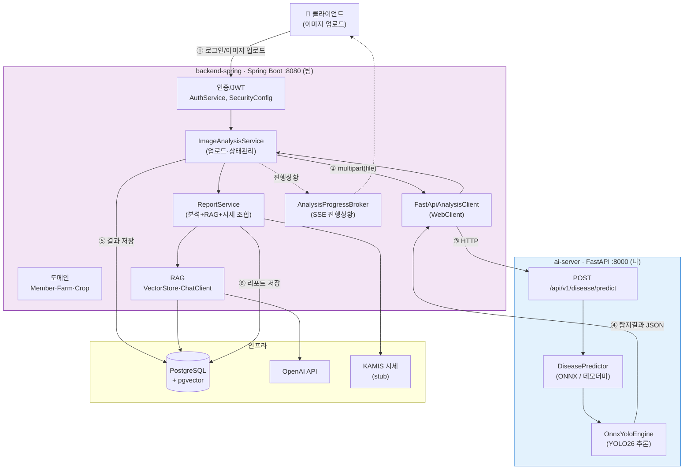
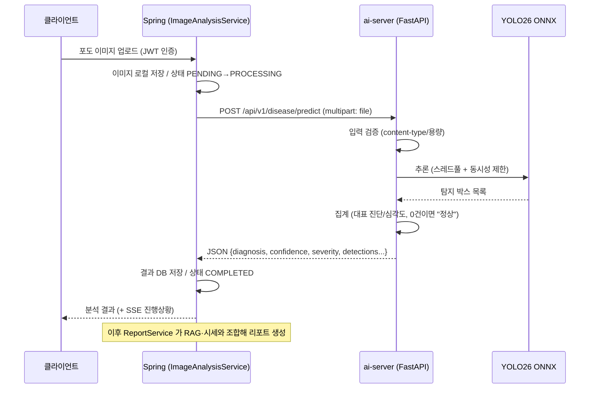
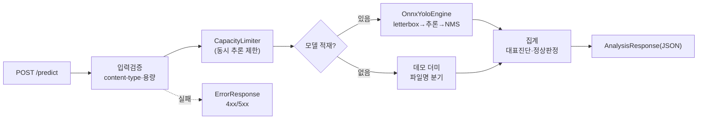

# NongSabu 프로젝트 종합 설명자료

> 팀 전체 흐름과 **내가 담당한 ai-server** 를 한눈에 이해하기 위한 문서.
> (아래 Mermaid 다이어그램은 Markdown 미리보기/GitHub 에서 이미지로 렌더링됨)

### 📊 발표용 시각화 (Whimsical)

| 자료 | 링크 | 미리보기 |
|---|---|---|
| 아키텍처 (ai-server 중심) | [열기](https://whimsical.com/QgCtbZas4S2cjJ2tTX4MtG) |  |
| 이미지 분석 요청 흐름 | [열기](https://whimsical.com/XFrSR3WFWztDQZhXtU6Dqf) |  |

---

## 1. 프로젝트 한 줄 요약

농작물(포도) 잎 사진을 업로드하면 **AI가 병충해를 탐지**하고, **RAG 문서 + 시세 정보**를 결합해
**대응 리포트**를 만들어 주는 서비스. **모노레포**(한 저장소)에 서버 2개가 폴더로 분리되어 있다.

```
NongSabu-Backend/
├── backend-spring/   ← Spring Boot (인증·도메인·RAG·리포트)   [팀]
└── ai-server/        ← FastAPI (YOLO26 ONNX 병충해 추론)      [나]
```

---

## 2. 팀원 역할 & 브랜치

| 담당자 | 브랜치 | 역할 |
|---|---|---|
| **나 (Polar-Bear-Poby)** | `feat/ai-server-구축` | **ai-server (FastAPI + YOLO26 ONNX 추론)** |
| tmdals1207 | `dev`, `feat/사용자-인증-JWT-구현`, `refactor/member-도메인-통합` | 인증/JWT, 회원·농장·작물 도메인, 통합, **Spring→FastAPI 연동 클라이언트** |
| kdh2929 | `feat/RAG` *(master 병합됨)* | Spring AI + pgvector + OpenAI 기반 **RAG**(PDF 청킹/임베딩/검색) |
| myungseo | `feat/LLM-프롬프트-처리` *(미병합)* | LLM 프롬프트 처리 |

---

## 3. 전체 아키텍처 (컴포넌트 + 소유자)



> 파란 박스(ai-server)가 **내 담당**, 보라 박스(Spring)가 팀 담당. 둘은 **HTTP로만** 통신한다.

---

## 4. 이미지 분석 요청 흐름 (시퀀스)



---

## 5. 내가 개발한 ai-server 상세

### 5-1. 설계 원칙
- **추론 전용**: 런타임에 torch/ultralytics 없이 **onnxruntime(CPU)** 만 사용 → 컨테이너 경량.
- **모델 분리**: `.pt → .onnx` 변환은 GPU 서버에서 오프라인, ai-server 는 `.onnx` 로드만.
- **비동기 동시성**: CPU 바운드 추론을 스레드풀 + `CapacityLimiter` 로 동시 실행 수 제한.
- **계약 우선**: Spring `AiAnalysisResponse` 와 100% 호환되는 응답(snake_case).

### 5-2. 모델 정책 (포도 전용 객체 탐지)
- 학습 클래스 **2개**: `노균병(HIGH)`, `탄저병(MEDIUM)`.
- **정상** = 별도 클래스 아님 → **탐지 박스 0건**으로 판정.
- 다작물 비대상(작물 무관 판별은 데이터셋 500GB+ 라 비현실적).

### 5-3. 내부 구조



### 5-4. 구현 파일

| 파일 | 역할 |
|---|---|
| `app/main.py` | lifespan(모델 1회 로드, limiter), CORS, 에러핸들러, 요청 로깅 |
| `app/core/config.py` | `AI_*` 환경변수(모델/추론/동시성/업로드) |
| `app/core/errors.py` | 도메인 예외 + `ErrorResponse` 핸들러 |
| `app/schemas/analysis.py` | Spring 계약 + `Detection` 확장 + `ErrorResponse` |
| `app/services/onnx_engine.py` | YOLO 추론(letterbox, **NMS/NMS-free 자동분기**, numpy NMS) |
| `app/services/disease_predictor.py` | ONNX 추론기 / 포도 데모 더미 / 팩토리 |
| `app/api/routes/analysis.py` | 추론 엔드포인트(검증+limiter+에러매핑) |
| `app/api/routes/health.py` | `/health`(준비상태), `/info`(모델 메타) |
| `tests/` | pytest 11개(분기·검증·에러·health) |

### 5-5. 엔드포인트

| Method | Path | 설명 |
|---|---|---|
| POST | `/api/v1/disease/predict` | 이미지 추론(핵심) |
| GET | `/health` | liveness + 모델 적재 여부 |
| GET | `/info` | 모델 버전·클래스·파라미터 |

### 5-6. 응답 예시
```json
{
  "success": true, "diagnosis": "노균병", "confidence": 0.92, "severity": "HIGH",
  "summary": "...", "recommended_action": "", "model_version": "yolo26-grape-onnx-v1",
  "detections": [{"class_name":"downy_mildew","label_ko":"노균병","confidence":0.92,
                  "severity":"HIGH","bbox":[384,216,512,288]}],
  "detection_count": 1, "image_size": {"width":1280,"height":720}, "inference_time_ms": 47.3
}
```

---

## 6. 현재 상태 & 남은 일

| 구분 | 상태 |
|---|---|
| FastAPI 서버 골격 / 엔드포인트 / 에러처리 / 테스트 | ✅ 완료 |
| ONNX 추론 파이프라인(탐지, NMS 자동분기) | ✅ 완료 |
| 데모 더미(파일명 분기) — 발표/시연용 | ✅ 완료 |
| uv 환경 / Dockerfile(uv 멀티스테이지) | ✅ 완료 |
| **실제 학습된 `.onnx` 모델** | ⬜ GPU 서버에서 학습/변환 후 연결 |
| 실모델 전환 | ⬜ `AI_MODEL_PATH` 지정 → 출력shape로 `AI_NMS_FREE` 고정 → `labels.json` 작성 |

---

## 7. 팀과 협의할 경계면

자세한 내용은 [INTEGRATION.md](INTEGRATION.md). 핵심 2가지:
1. **대응문구(`recommended_action`) 생성 주체** — RAG(kdh2929) vs ai-server.
2. **포도 전용 게이트** — 비포도 작물 차단을 Spring 이 호출 전에 처리(확정 필요).

관련 문서: [API.md](API.md)(응답 계약) · [INTEGRATION.md](INTEGRATION.md)(협의 항목)
