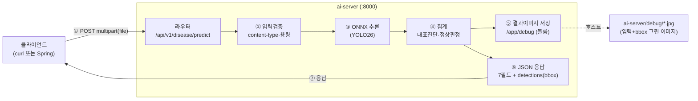

# curl로 ai-server 검증하기 — 요청부터 결과 저장·응답까지

> 목적: **클라이언트(curl) → ai-server 추론 → 내부 볼륨에 결과 이미지 저장 → 클라이언트로 결과(JSON) 응답** 의
> 전 과정을 한 문서로 이해하고 팀원에게 설명하기 위한 가이드.
>
> 핵심: **curl 요청은 Spring 백엔드(`FastApiAnalysisClient`)가 보내는 HTTP 요청과 완전히 동일**하다.
> 그래서 Spring 없이 curl만으로 ai-server를 그대로 검증할 수 있다.

---

## 0. 전체 흐름 한눈에



- **①·⑦ = 클라이언트와 주고받는 HTTP**(요청/응답)
- **⑤ = ai-server 내부 볼륨에 저장되는 검증용 이미지**(API 응답과 별개, 디버그용)
- **⑥ = 클라이언트에게 실제 전달되는 결과물**(bbox 좌표 + 병명)

---

## 1. ① 요청 — curl (= Spring 요청 양식)

ai-server는 `POST /api/v1/disease/predict` 에 **`multipart/form-data`, 파트 이름 `file`** 로 이미지를 받는다.

```bash
curl -X POST http://localhost:8000/api/v1/disease/predict \
     -F "file=@<이미지경로>.jpg;type=image/jpeg"
```

**Spring 과 동일한 이유** — Spring 의 `FastApiAnalysisClient` 는 다음을 보낸다:
- `POST {AI_SERVER_BASE_URL}/api/v1/disease/predict`
- `Content-Type: multipart/form-data`
- 파트 이름 **`file`** + 원본 파일명 + content-type

→ curl `-F "file=@...;type=image/jpeg"` 가 만드는 멀티파트와 **바이트 단위로 동일**하다. ai-server 는 보낸 주체(curl/Spring)를 구분하지 못한다.

> 참고: Windows 에서 curl 은 한글 경로 파일을 못 여는 경우가 있으니, 한글 경로면 ASCII 경로로 복사 후 요청한다.

---

## 2. ②~④ ai-server 내부 처리

| 단계 | 내용 | 실패 시 |
|---|---|---|
| ② 입력검증 | content-type 이 `image/*` 인지, 빈 파일/용량(≤`AI_MAX_UPLOAD_MB`) 검사 | `400 INVALID_IMAGE` / `413` (추론 전) |
| ③ ONNX 추론 | YOLO26 ONNX(`models/yolo26-grape.onnx`)로 추론. CPU 바운드라 스레드풀 + `CapacityLimiter`로 동시요청 제한 | `500 INFERENCE_FAILED` |
| ④ 집계 | 탐지 박스 → 대표 진단(최고 신뢰도) + 종합 severity. **탐지 0건이면 "정상"** | — |

- 모델 클래스 2개: **노균병 / 탄저병** (정상 = 탐지 0건). `models/labels.json` 으로 한글명·severity 매핑.
- `AI_CONF_THRESHOLD`(현재 0.25) 미만 박스는 버림. `AI_NMS_FREE=true`(모델 출력 `[1,300,6]` = NMS 내장).

---

## 3. ⑤ 내부 볼륨에 저장되는 결과물 (검증용)

`AI_SAVE_ANNOTATED=true` 이면, 추론 후 **입력 이미지에 bbox·병명을 그린 이미지**를 컨테이너 내부 `/app/debug` 에 저장한다.

- 컨테이너 경로: `/app/debug/<원본이름>_annotated.jpg`
- 호스트 경로(볼륨 마운트): **`ai-server/debug/<원본이름>_annotated.jpg`**
- compose 마운트: `./ai-server/models:/app/models:ro`, **`./ai-server/debug:/app/debug`**
- 라벨은 컨테이너에 설치된 한글 폰트(fonts-nanum)로 렌더링.

```
ai-server/debug/
├── 223907_..._annotated.jpg   (입력 + 박스 7개)
└── 225390_..._annotated.jpg   (입력 + 박스 1개)
```

> 이건 **검증/시연용 부가 출력**이다. API 응답(⑥)에는 영향이 없으며, 운영에서 끄려면 `AI_SAVE_ANNOTATED=false`.
> 클라이언트가 화면에 박스를 그릴 때는 이 이미지가 아니라 **응답의 좌표(⑥)** 를 쓴다.

---

## 4. ⑥ 클라이언트로 전달되는 결과물 (응답 JSON)

응답은 **요약 7필드(Spring 계약) + 클라이언트 렌더링용 확장(detections)** 이다.

```json
{
  "success": true,
  "diagnosis": "탄저병",
  "confidence": 0.71,
  "severity": "MEDIUM",
  "summary": "1건의 병충해가 탐지되었습니다(대표: 탄저병).",
  "recommended_action": "",
  "model_version": "yolo26-grape-onnx-v1",

  "detections": [
    { "class_name": "anthracnose", "label": "탄저병",
      "confidence": 0.71, "bbox": [2009.5, 1564.8, 611.4, 769.6] }
  ],
  "detection_count": 1,
  "image_size": { "width": 3000, "height": 4000 }
}
```

| 영역 | 필드 | 설명 |
|---|---|---|
| 요약(Spring 계약) | `success,diagnosis,confidence,severity,summary,recommended_action,model_version` | Spring `AiAnalysisResponse` 와 1:1 (snake_case) |
| 확장(렌더링용) | `detections[]` | `class_name`(영문)·`label`(한글)·`confidence`·**`bbox=[x,y,w,h]`** |
| 확장 | `detection_count`,`image_size` | 박스 수, **bbox 기준 원본 해상도** |

- **bbox**: 원본 이미지 좌표계의 `[x, y, width, height]`(픽셀, 좌상단 원점). 클라이언트는 `image_size` 대비 자신이 표시하는 크기로 비율 변환해 박스를 그린다. → **결과 이미지를 되돌려보내지 않고 좌표만 전달**(전송량 최소).
- `recommended_action` 은 빈 문자열(대응문구는 Spring RAG 가 생성 — 팀 합의 사항).
- 탐지 0건이면 `diagnosis:"정상", detections:[]`.

---

## 5. 실제 검증 결과 (2개 이미지, curl = Spring 양식)

| 이미지 | 진단 | severity | detection_count | image_size | 비고 |
|---|---|---|---|---|---|
| `223907_..._388.jpg` | 탄저병 | MEDIUM | **7건** (conf 0.25~0.49) | 2160×2880 | 정답=탄저병 일치 |
| `225390_..._8.jpg` | 탄저병 | MEDIUM | **1건** (conf 0.71) | 3000×4000 | 정답=탄저병 일치 |

각 요청마다 `ai-server/debug/<이름>_annotated.jpg` 에 박스 그린 이미지가 저장됨.

검증 3요소 모두 확인:
1. **이미지 수신** ✅ (multipart `file` 수신, 검증 통과)
2. **추론 수행** ✅ (ONNX → 탄저병 탐지, 정답 일치)
3. **결과물 생성** ✅ (JSON: bbox+병명 / 내부볼륨: annotated 이미지)

---

## 6. 빠른 실행 절차 (요약)

```bash
# 1) ai-server만 기동 (postgres/spring/RAG 불필요 — 이미지 분석은 독립 경로)
docker compose up -d --build --no-deps ai-server
curl -s http://localhost:8000/health      # {"status":"ok","model_loaded":true,"mode":"onnx"}

# 2) Spring 과 동일한 양식으로 이미지 요청
curl -s -X POST http://localhost:8000/api/v1/disease/predict \
     -F "file=@샘플.jpg;type=image/jpeg"

# 3) 결과 확인
#    - 응답(JSON): 위 ⑥ — bbox + 병명
#    - 내부 저장 이미지: ai-server/debug/샘플_annotated.jpg  (입력 + 박스)
```

또는 검증 스크립트 `ai-server/test.py` 사용(폴더 단위 일괄, `test_results/` 에 annotated + result.json 저장):
```bash
uv run python test.py <이미지_또는_폴더>
```

---

## 7. 참고

- **한글 깨짐**: 콘솔에서 `... | python -m json.tool` 은 한글을 `\uXXXX` 이스케이프로 보일 수 있으나 **실제 JSON/저장 파일은 UTF-8 정상**이다. raw 로 보거나 `PYTHONIOENCODING=utf-8` 사용.
- **conf 임계값**: `AI_CONF_THRESHOLD`(현재 0.25). 올리면 탐지 수↓(정밀도↑), 내리면 탐지 수↑(재현율↑). `.env` 수정 후 `docker compose up -d --force-recreate ai-server` 로 즉시 반영.
- **모델 범위**: 포도 전용(노균병·탄저병). 그 외 병해는 미지원(오분류 가능) — 포도 외 작물 차단은 Spring 작물 게이팅이 담당.
- 관련 문서: 응답 계약 [API.md](API.md), 연동 협의 [INTEGRATION.md](INTEGRATION.md), 종합 [OVERVIEW.md](OVERVIEW.md), 프로젝트 아키텍처 [../../docs/architecture-and-usecases.md](../../docs/architecture-and-usecases.md).
```
