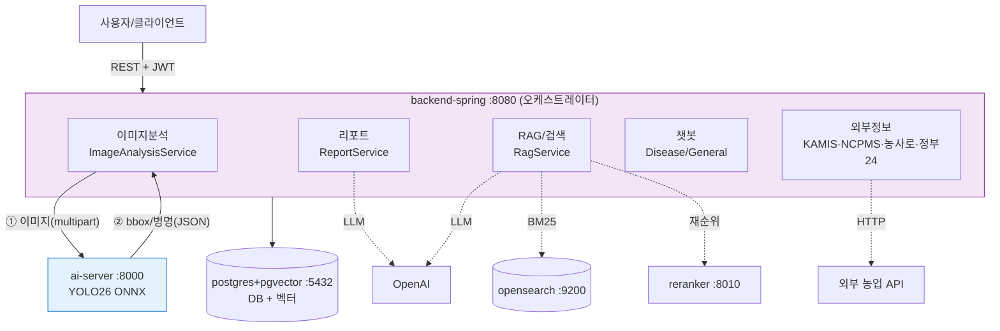

# NongSabu 백엔드 — 아키텍처 & 유스케이스 분석

> 목적: 프로젝트 전체 구성과 사용 흐름을 정리하고, **"어떤 컨테이너가 필수이고 무엇을 끌 수 있는지"**(특히 로컬에서 이미지 분석만 검증할 때)를 근거와 함께 명확히 한다.
> 작성 시점 기준 브랜치: 통합 `dev` (Spring RAG/tool-call + ai-server).

---

## 1. 한눈에 보기

농작물(포도) 잎 이미지를 올리면 **AI가 병충해를 탐지**하고, 필요 시 **RAG 문서 + 시세/외부정보 + LLM**으로 **대응 리포트**를 만들어 주는 서비스. **모노레포 + 멀티 서비스**(컨테이너 5개).

```
NongSabu-Backend/
├── backend-spring/    Spring Boot  :8080  — 인증·도메인·이미지분석 오케스트레이션·RAG·리포트
├── ai-server/         FastAPI      :8000  — YOLO26 ONNX 포도 병충해 추론  ← 내 담당
├── reranker-server/   FastAPI      :8010  — 검색 결과 재순위(BAAI bge-reranker)
├── (opensearch)       OpenSearch   :9200  — BM25 키워드 검색(RAG 하이브리드)
└── (postgres)         pgvector pg16:5432  — 관계형 DB + 벡터스토어
```

---

## 2. 시스템 구성도



- **파란색 ai-server = 내 담당.** Spring과는 **HTTP 동기 요청/응답**(① 요청 → ② 응답).
- 이미지 분석(①②)은 **RAG/opensearch/reranker/LLM과 완전히 분리**된 독립 경로다.

---

## 3. 컴포넌트 역할

### 3.1 backend-spring 도메인 (14개)
| 도메인 | 핵심 엔드포인트 | 역할 |
|---|---|---|
| auth | `POST /api/v1/auth/signup`,`/login` | JWT 회원가입·로그인 |
| member | `GET/PUT /api/v1/members/me` | 내 정보 |
| farm / farmprofile | `POST/GET/PUT /api/v1/farms`, `/farm-profiles` | 농장·프로필 |
| crop / usercrop | `GET /api/v1/crops`, `POST /api/v1/farms/{id}/crops` | 작물 목록·등록 |
| **image** | `POST /api/v1/analysis/images`(+`/{id}/stream` SSE) | **이미지 업로드 → ai-server 호출 → 결과 저장** |
| report | `POST /api/v1/reports/images/{imageId}` | 분석결과 + RAG문맥 + 시세 + LLM 리포트 |
| document | `POST /api/v1/documents`, `/rag/search`, `/rag/ask` | PDF 청킹·임베딩·색인, 하이브리드 RAG |
| chat | `POST /api/v1/chat/disease`,`/general` | RAG 기반 챗봇 |
| agri | `GET /api/v1/agri/*` | 외부 농업 API 통합(시세/병해충/용어/정책) |
| externalapilog / toolcalllog / debug | — | 외부호출·도구호출 로깅, 통합 디버그 |

### 3.2 ai-server (내 담당)
- `POST /api/v1/disease/predict` — 이미지 multipart 수신 → **YOLO26 ONNX** 추론 → **bbox + 병명(노균병/탄저병) + 신뢰도** JSON 반환. 탐지 0건이면 "정상".
- 동기 요청/응답. 동시요청은 이벤트루프 + `CapacityLimiter`로 처리. 모델은 기동 시 1회 로드.
- 상세 계약: [ai-server/docs/API.md](../ai-server/docs/API.md).

### 3.3 reranker-server / opensearch / postgres
- **reranker-server**: FastAPI, `BAAI/bge-reranker-v2-m3`로 하이브리드 검색 후보 재순위. 모델 로드 실패 시 어휘기반 폴백.
- **opensearch**: BM25 키워드 검색(RAG 하이브리드용).
- **postgres(pgvector)**: 모든 도메인 데이터 + 벡터스토어(임베딩). Spring AI `initialize-schema=true`로 기동 시 벡터 스키마 생성.

---

## 4. 주요 유스케이스

### UC-1. 회원/농장/작물 설정
`signup → login(JWT) → 농장 등록 → 작물 등록`. 필요한 외부 시스템: **postgres만.**

### UC-2. 이미지 병충해 분석 ⭐ (ai-server 핵심)
```
POST /api/v1/analysis/images (이미지 + cropId)
 → ImageAnalysisService: 작물 게이팅(포도만) → 로컬 저장 → FastApiAnalysisClient
 → ai-server /disease/predict (ONNX) → bbox/병명/신뢰도
 → 결과 DB 저장 + SSE 진행률 → 응답
```
필요한 외부 시스템: **postgres + ai-server.** (RAG/opensearch/reranker/LLM **불필요**)

### UC-3. 대응 리포트 생성
`POST /reports/images/{imageId}` → RAG 문맥 + KAMIS 시세 + LLM(또는 규칙 폴백) → 리포트. (RAG/LLM 사용)

### UC-4. 문서 RAG / 챗봇
`문서 업로드(PDF) → 청킹 → 임베딩(pgvector) + BM25 색인(opensearch)` / `검색(VECTOR·BM25·HYBRID·HYBRID_RERANK) → LLM 답변`. (opensearch·reranker·LLM 사용)

---

## 5. 부팅 의존성 매트릭스 (★ 핵심)

| 시스템 | 연결 시점 | 부팅 필수? | 실패 모드 |
|---|---|---|---|
| **postgres** (datasource + Flyway) | **EAGER** | ✅ **필수** | 없으면 부팅 실패 |
| **postgres pgvector** (벡터스토어 스키마) | **EAGER** | ✅ **필수** | 없으면 부팅 실패 |
| 로컬 파일시스템(업로드 dir) | EAGER(@PostConstruct) | ✅ 필수 | 디렉토리 생성 실패 시 부팅 실패 |
| **ai-server** (이미지 분석) | LAZY(이미지 업로드 시) | ❌ | 호출 실패 → 해당 분석 FAILED |
| **opensearch** (BM25) | **LAZY**(문서/RAG 호출 시) | ❌ | RAG 호출만 실패, 부팅·이미지분석 OK |
| **reranker** (재순위) | **LAZY**(hybrid-rerank 시) | ❌ | graceful 폴백(재순위 없이 RRF) |
| **OpenAI LLM** | LAZY(리포트/답변 시) | ❌ | `app.llm.enabled=false`면 Stub→규칙 폴백 |

**결론**:
- **부팅 필수 = postgres(pgvector) 뿐.** opensearch·reranker·LLM·ai-server는 모두 LAZY → **없어도 Spring은 부팅된다.**
- 따라서 **이미지 분석만 검증하려면 `postgres + ai-server + backend-spring` 3개로 충분**하고, **opensearch·reranker는 제외 가능**하다. (RAG/리포트 호출만 안 하면 됨)
- ⚠️ 단, backend-spring의 `depends_on`에 opensearch·reranker가 `service_healthy`로 묶여 있으면 compose가 기동을 막으므로, 최소 실행 시 **그 depends_on을 풀어야** 한다.

> 참고: 이전에 겪은 Spring 부팅 실패는 RAG 때문이 **아니라** postgres 비밀번호 불일치(스테일 볼륨)였다. `.env`의 계정과 postgres 볼륨 자격증명을 일치시키면(또는 볼륨 리셋) 해결된다.

---

## 6. 설정 토글 (application.yml / env)

| 토글 | 기본 | 효과 |
|---|---|---|
| `app.llm.enabled` (`APP_LLM_ENABLED`) | false | true=OpenAI LLM, false=Stub(빈/규칙) |
| `app.reranker.enabled` (`RERANKER_ENABLED`) | true | false=재순위 끔(RRF만) |
| `spring.ai.vectorstore.pgvector.initialize-schema` | true | 기동 시 벡터 스키마 생성(EAGER) |
| `app.ai-server.base-url` (`AI_SERVER_BASE_URL`) | http://localhost:8000 | Spring→ai-server 주소 |
| `app.opensearch.base-url` / `app.reranker.base-url` | :9200 / :8010 | RAG 인프라 주소 |

---

## 7. 로컬 최소 실행 구성 (이미지 분석 검증용)

목표: **클라이언트 이미지 업로드 → ai-server 추론(bbox/병명) 반환** 검증. RAG 불필요.

| 서비스 | 포함 | 이유 |
|---|---|---|
| postgres | ✅ | Spring 부팅·분석결과 저장 필수 |
| ai-server | ✅ | 추론(내 담당) |
| backend-spring | ✅ | 업로드 클라이언트(오케스트레이터) |
| opensearch | ❌ 제외 | RAG 전용(이미지 분석 무관) |
| reranker-server | ❌ 제외 | RAG 재순위 전용 |

실행 시 주의:
1. backend-spring `depends_on`에서 opensearch·reranker(`service_healthy`) 제거.
2. `APP_LLM_ENABLED`/`RERANKER_ENABLED`는 끈 채로 둬도 됨(LAZY).
3. postgres 자격증명 = Spring datasource 계정 일치(불일치 시 볼륨 리셋 `docker compose down -v`).
4. ai-server는 dev compose에 모델 배선(env_file/volumes)이 없으므로 로컬 실행 시 추가 필요.

> compose 파일 자체의 정식 구조 변경(서비스 토글·env_file 분리)은 **compose 담당(백엔드 팀원)** 영역. 위는 로컬 검증용 최소 구성 지침이다.

---

## 8. 데이터 흐름 요약

```
이미지 분석:  사용자 → Spring(작물 게이팅·저장) → ai-server(ONNX) → bbox/병명 → 저장/응답
리포트:       분석결과 → RAG 문맥 + KAMIS 시세 + LLM → 대응 리포트
문서 RAG:     PDF → 청킹 → 임베딩(pgvector)+BM25(opensearch) → 검색(+재순위) → LLM 답변
```

- **이미지 분석은 독립 모듈** — RAG/검색 인프라와 분리되어, 그것들 없이도 완전 동작한다.
- ai-server 응답 계약(7필드 + detections)은 [ai-server/docs/API.md](../ai-server/docs/API.md), 연동 협의는 [ai-server/docs/INTEGRATION.md](../ai-server/docs/INTEGRATION.md) 참고.
